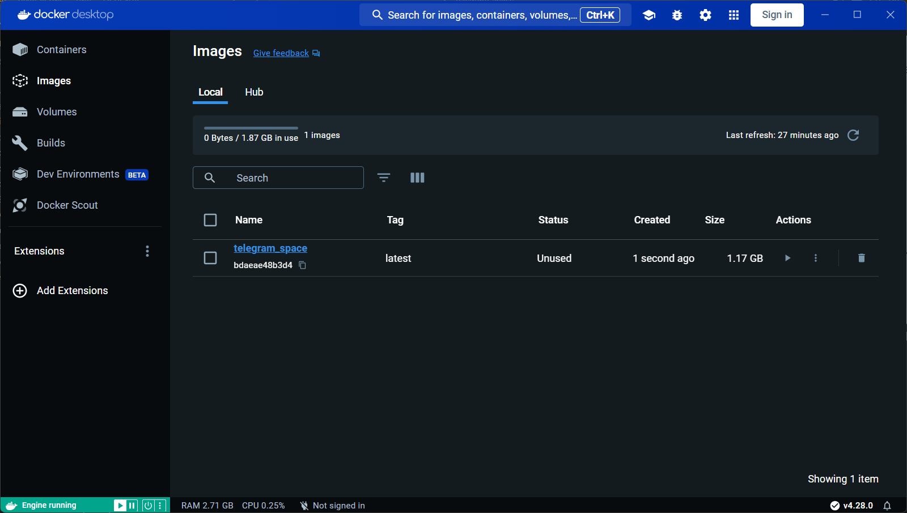
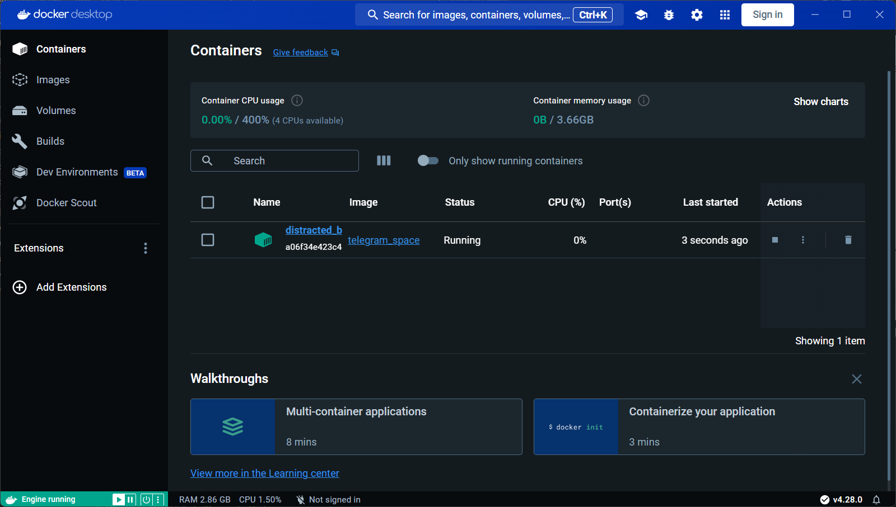

# Telegram_space 


___
#### Это telegram bot который оправляет фотографии космоса.
___
>### Для запуска программы требуется:
 * скачать [Python](https://www.python.org/) версии 3.1 или выше.
 * операционная система macOS, linux, windows 7 или выше.
 * установить все нужные библиотеки Python командой:
```
pip install -r requirements.txt
```
___
>### Переменные окружения:
 * `API_NASA` - ваш API токен `NASA`.
 * `ID_LAUNCH` - ваш ID запуска ракеты `SpaceX`.
 * `API_BOT` - API `telegram бота` которого вы создадите в telegram.
 * `CHAT_ID` - ID чата в которого будут отправляться фотографии.
 * `TIME_SLEEP` - время отправки между фотографий.
___
>### Как запустить программу:

* Прежде чем запустить программу нужно скачать фотографии с помощью кода, либо добавить свои фотографии.

* Как скачать фотографии NASA:
    * В консоли пишем команду:
    ```
    python fetch_nasa.py
    ```
* Как скачать фотографии SpaceX:
    * В консоли пишем команду:
    ```
    python fetch_spacex_launch.py id_launch
    ```
    * id_launch - это ваш `ID` запуска SpaceX :rocket:.
    * По умолчанию `id_launch` уже записан.
* Как скачать фотографии EPIC:
    * В консоли пишем команду:
    ```
    python fetch_epic_image.py
    ```
* Как только скачали, либо добавили фотографии запускаем основную программу.
    ```
    python telegram_bot.py time_sleep
    ```
    * `time_sleep` - время отправки между фотографиями. По умолчанию время стоит 4 часа, но вы можете поставить и своё время.`(время выстовляется в секндах)`.
___
>### Как работать с Dockerfile:

* Для того чтобы запустить, `Dockerfile` на своем компьютере, вам потребуется установить [Docker Desktop](https://www.docker.com/products/docker-desktop/)
* Далее запустите программу `Docker Dosktop`.
* После запуска `Docker Desktop`, в консоле напишите команду:
```
docker build -t telegram_space .
``` 
* `telegram_space` - название вашего образа
* `.` - путь до `Dockerfile`
* Далее в вашем `Docker Desktop` добавиться образ

* После, вам требуется запустить этот образ. В консоле напишите команду:
```
docker run telegram_space
```
* `telegram_space` - название вашего образа который вы создавали ранее.
* После образ соберется в контейнер и бот будет запущен.


>### Цель проекта:
* Код написан в образовательных целях 